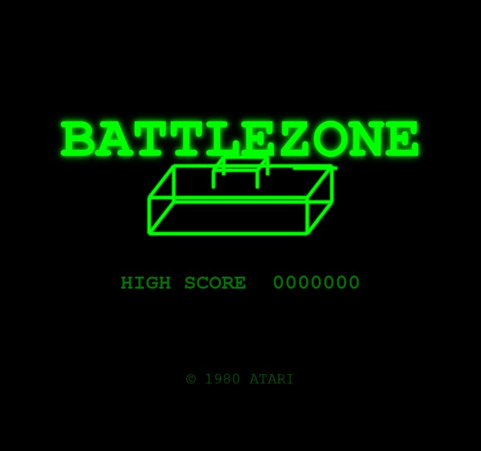
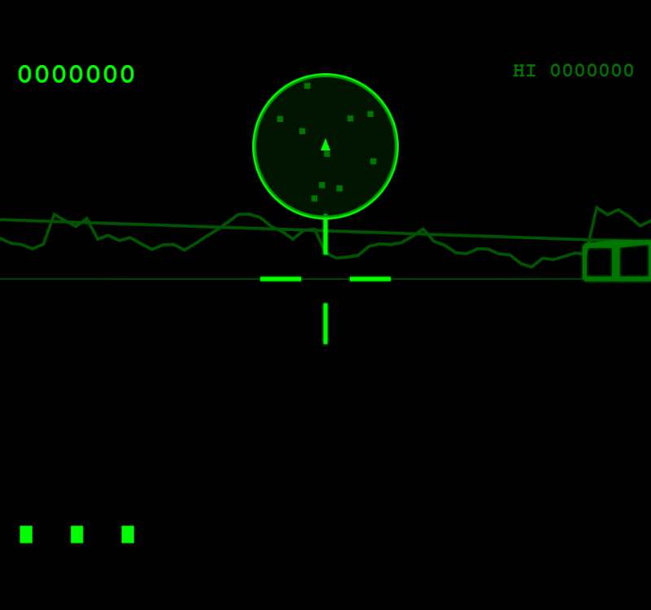
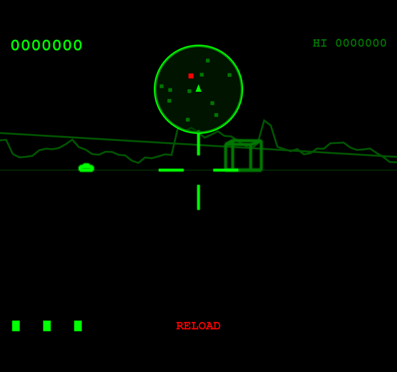

# Battlezone

A faithful TypeScript recreation of Atari's **Battlezone** (1980), the pioneering first-person 3D tank combat arcade game designed by Ed Rotberg.

Built with Canvas 2D and Web Audio API — zero runtime dependencies, no sprite sheets, no audio files. All wireframe 3D graphics are projected and drawn procedurally, all sounds synthesized via Web Audio.

<p align="center">
  
  
  
</p>

## Play

```bash
npm install
npm run dev
```

Open http://localhost:5173 in your browser.

## Controls

| Key | Action |
|-----|--------|
| Up Arrow (or W) | Move forward |
| Down Arrow (or S) | Move backward |
| Left Arrow (or A) | Turn left |
| Right Arrow (or D) | Turn right |
| Space | Fire cannon |
| M | Toggle mute |

## Gameplay

You command a tank on a flat battlefield dotted with geometric obstacles, viewed through a first-person wireframe display. Enemy vehicles spawn in the distance and advance toward you — destroy them with your cannon before they destroy you.

### Enemies

- **Tank** (1,000 pts) — Standard enemy tank; approaches and fires at medium range
- **Super Tank** (3,000 pts) — Brighter, faster, fires twice as often
- **Missile** (2,000 pts) — Guided projectile that homes toward your position
- **Flying Saucer** (5,000 pts) — Fast-moving disc that weaves across the battlefield

### Features

- **Radar display** — Top-center mini-map shows obstacles (dark green), enemies (red), and your facing direction
- **Obstacle cover** — Use cubes and pyramids as shield against enemy fire; shells impact obstacles
- **Cannon reload** — 2-second cooldown between shots, indicated by red RELOAD text
- **Difficulty progression** — Enemy types escalate based on kills (Super Tanks at 6 kills, Missiles at 15, Saucers at 24)
- **Extra lives** — Awarded at 15,000 and 100,000 points

## Architecture

| Module | Purpose |
|--------|---------|
| `src/game.ts` | Main orchestrator — FSM states, input, scoring, lives |
| `src/world/world.ts` | Game world state — player, enemies, shells, collision detection |
| `src/world/objects.ts` | Wireframe 3D model definitions (tank, cube, pyramid, missile, saucer) |
| `src/rendering/renderer.ts` | 3D wireframe projection, radar, HUD, attract/game over screens |
| `src/core/math.ts` | 3D math — camera transform, perspective projection, distance/angle utilities |
| `src/systems/sound.ts` | Web Audio procedural sound synthesis |
| `src/states/` | Generic FSM: Attract, Playing, Death, GameOver |

### Technical Highlights

- **Software 3D pipeline**: World-to-camera transform, perspective projection, painter's algorithm depth sorting — all in Canvas 2D
- **Wireframe models**: Tank (body + turret + barrel), obstacles, missiles, and saucers defined as vertex/edge arrays
- **Mountain skyline**: Procedurally generated jagged silhouette wrapping the full 360-degree horizon
- **Ground grid**: Perspective-correct grid lines that scroll with player movement
- **Fixed-timestep accumulator**: Physics locked at 60 FPS, rendering at display refresh rate
- **3x render scale**: 960x768 canvas (320x256 native) for crisp green-on-black vector aesthetics

## History

Battlezone was released by Atari in November 1980, designed by Ed Rotberg. It was one of the first mainstream games to feature a first-person 3D perspective, rendered entirely with vector graphics on a black-and-white monitor behind a green/red overlay. The game used a Motorola 6502 CPU with custom vector hardware (the Atari Vector Generator) to draw its wireframe world in real time.

The game's realistic tank combat caught the attention of the U.S. Army, who contracted Atari to build a modified version called the "Bradley Trainer" for military training purposes — making it one of the earliest examples of a video game adapted for military simulation.

The original cabinet featured a unique periscope viewfinder that players looked through, enhancing the immersive first-person experience. The green tint of the display and the simple geometric obstacles became iconic elements of early 3D gaming.

## Build

```bash
npm run build     # TypeScript compile + Vite bundle to /dist
npm run preview   # Preview production build
```

## License

MIT
